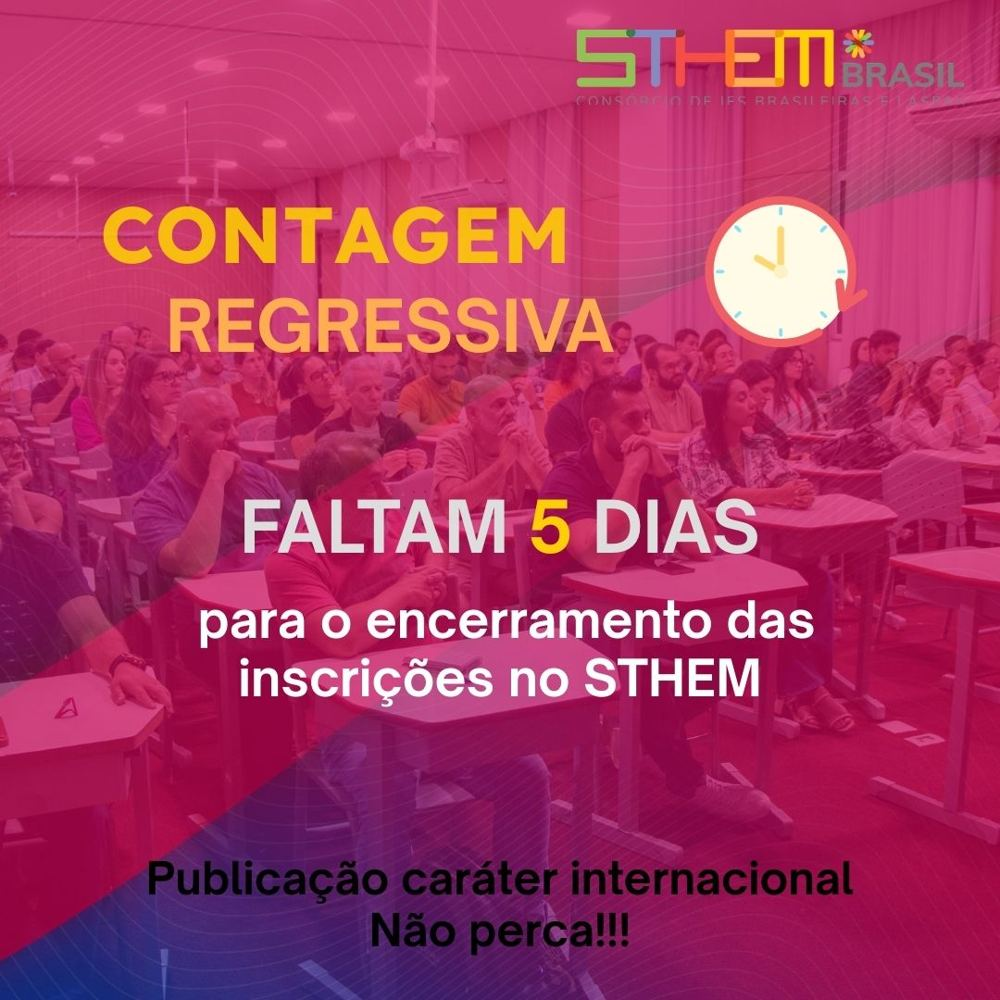
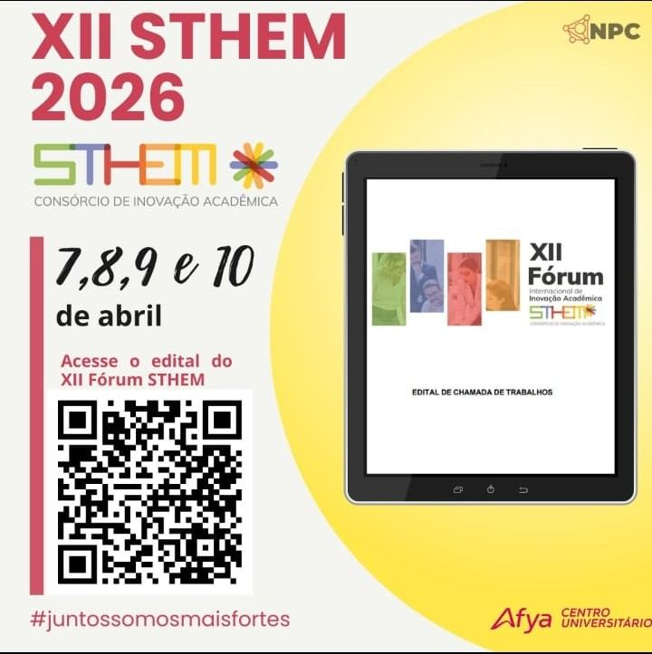

Ação institucional de mobilização acadêmica voltada ao fortalecimento da produção científica e à participação de docentes e estudantes no XII Fórum Internacional de Inovação Acadêmica. A iniciativa utilizou comunicação estratégica em formato de contagem regressiva para reforçar prazos de submissão, ampliar o engajamento da comunidade acadêmica e estimular a divulgação de pesquisas, projetos e experiências exitosas desenvolvidas na instituição.

::: {.destaque}
Produção científica, engajamento acadêmico, internacionalização.
:::

## Evidências

::: {layout-ncol=2}

:::
