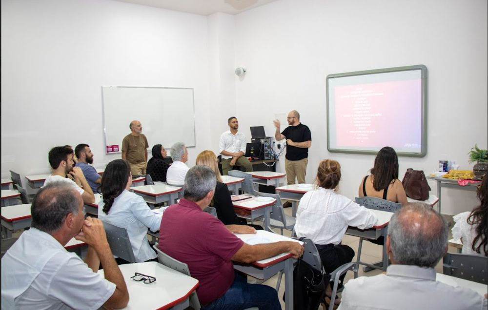
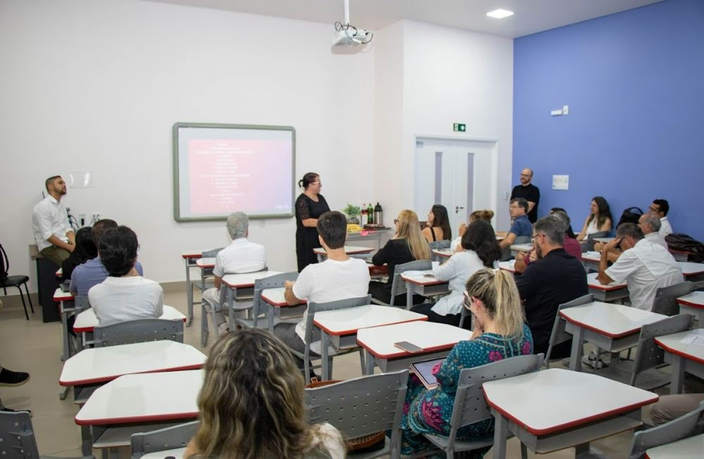
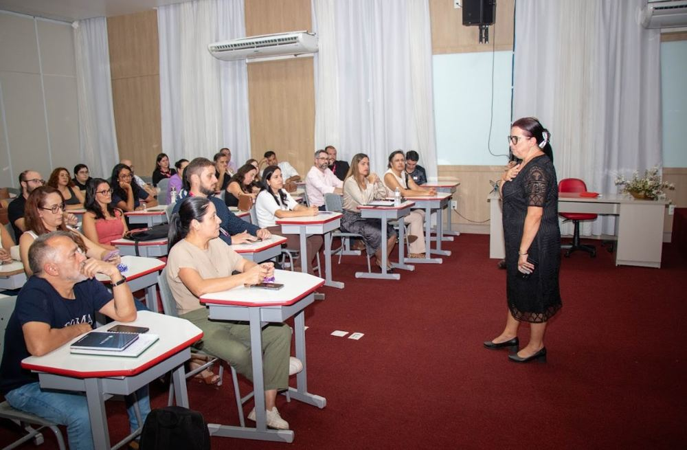
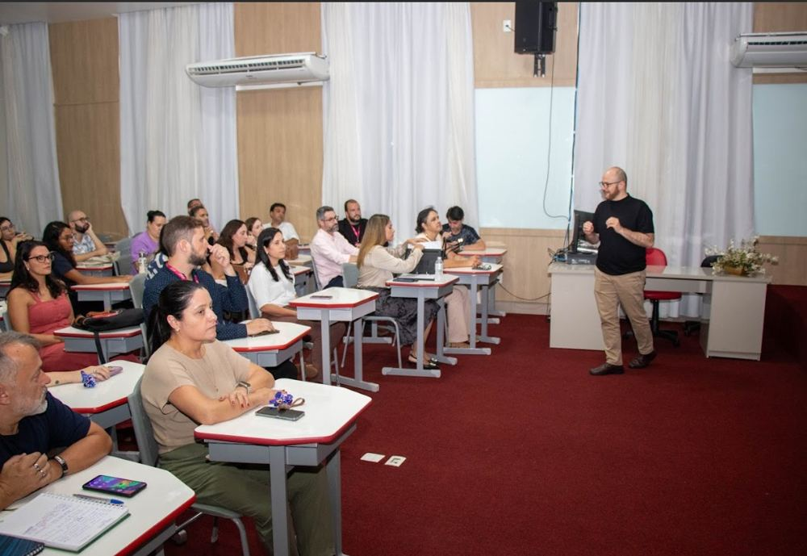

Ação de acolhimento e recepção de professores dos cursos de Medicina e SHE, com foco na integração institucional, apresentação inicial de orientações acadêmicas e fortalecimento do vínculo com a equipe gestora e o NAPED.

::: {.destaque}
Acolhimento docente, integração institucional, professores Medicina e SHE.
:::

## Evidências

::: {layout-ncol=2}

:::
