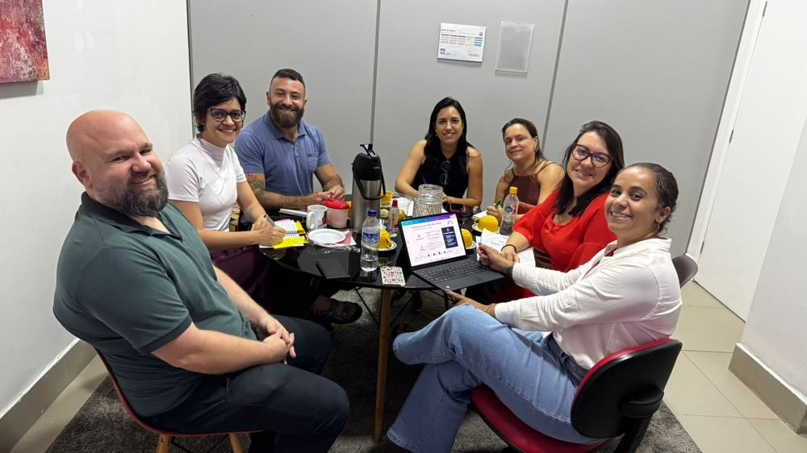

Reunião de alinhamento entre o NAPED, os especialistas de eixo e a coordenadora do NED, com foco na construção e padronização do memorial docente, fortalecendo a integração entre os setores e a qualidade da documentação pedagógica institucional.

::: {.destaque}
Memorial docente, alinhamento institucional, especialistas de eixo.
:::

## Evidências

