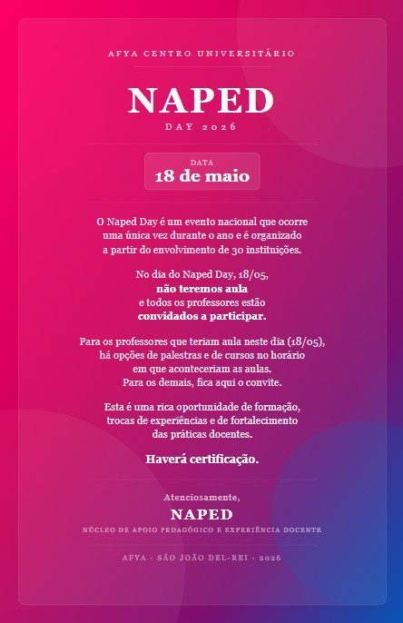
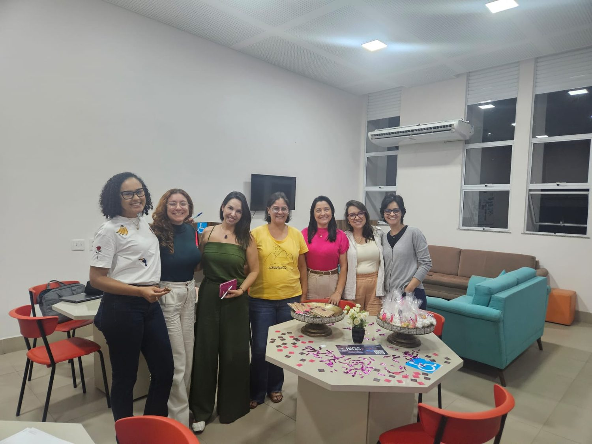
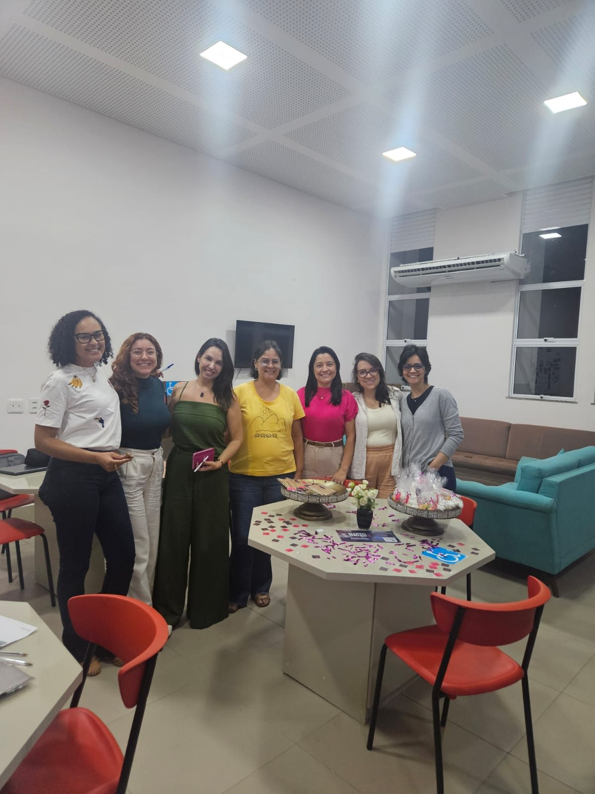
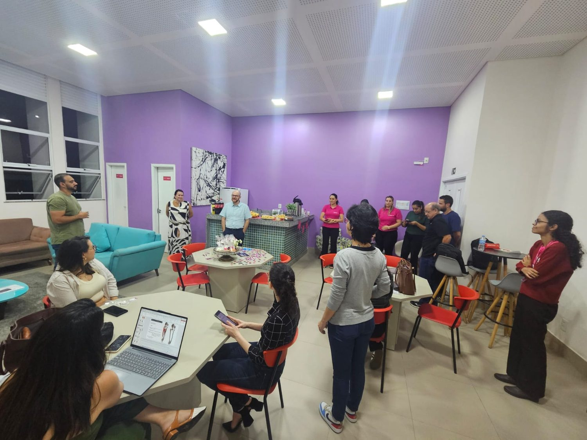
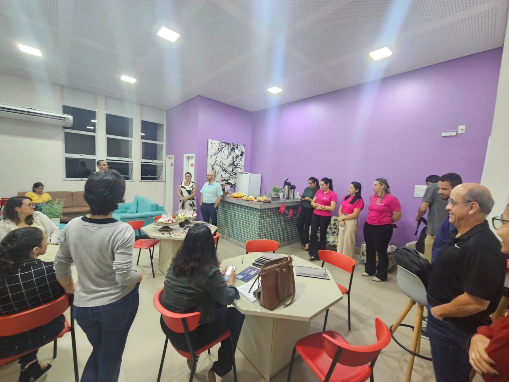
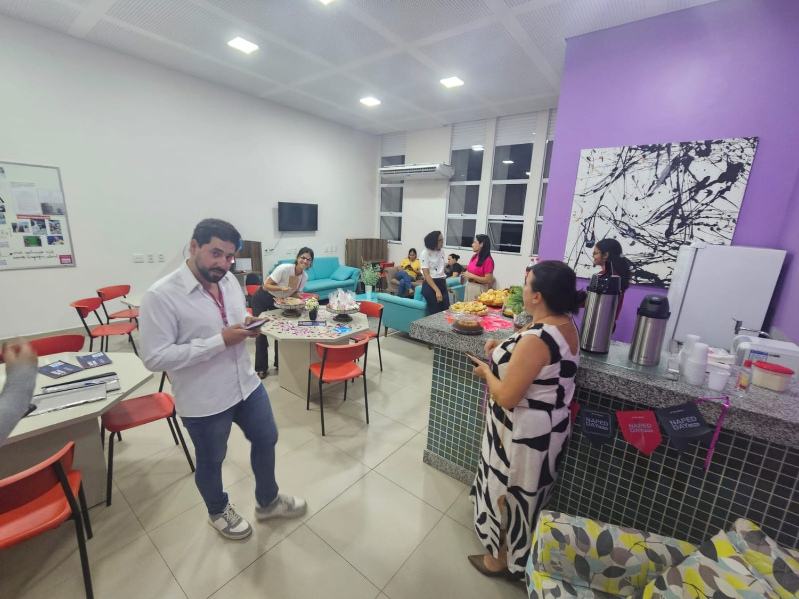
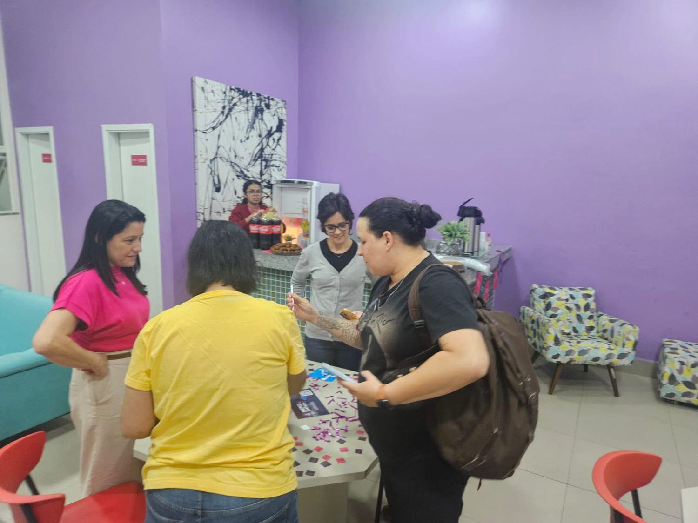
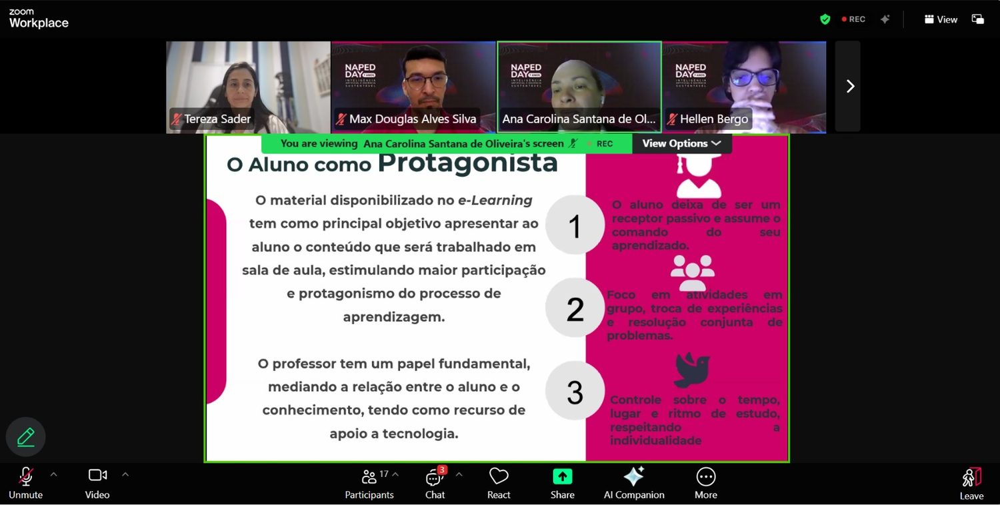
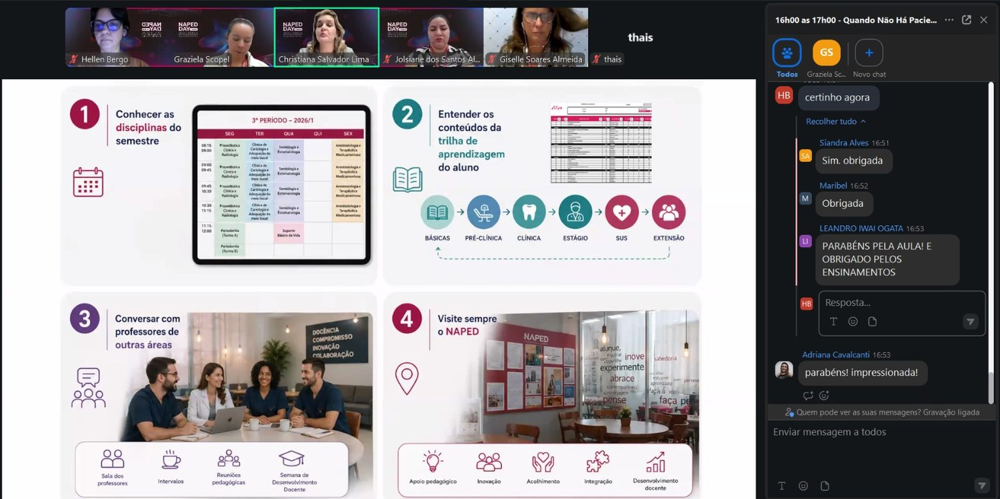

O NAPED Day é um evento nacional da Afya que ocorre uma única vez ao ano, organizado a partir do
 envolvimento de 30 instituições, e em 2026 celebrou seus **7 anos** com o tema
 *"Inteligência Artificial e Docência Sustentável"*, realizado em 18 de maio. No dia do evento
 não há aulas e todos os professores são convidados a participar de palestras, oficinas e cursos,
 com certificação. A mobilização local — divulgação, convites e organização — teve início em abril,
 culminando em uma programação que integrou o Dia D presencial e oficinas
 formativas online.

## Evidências

::: {layout-ncol=2}

:::
