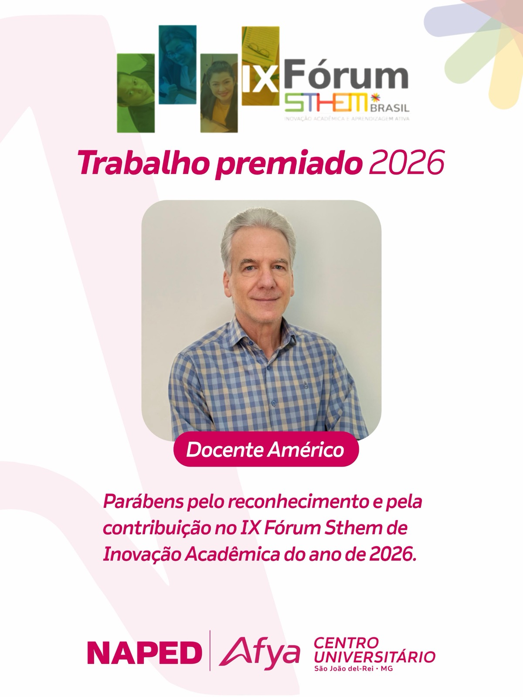
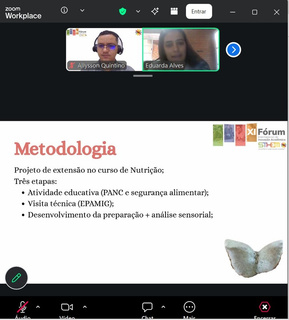
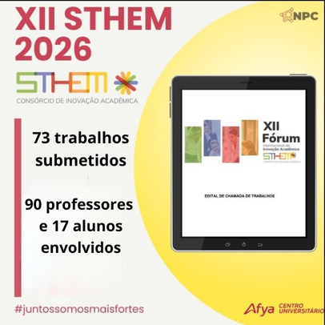

A Afya São João del Rei conquistou destaque expressivo no **IX Fórum STHEM Brasil 2026**, evento de referência em inovação acadêmica e aprendizagem ativa. Três docentes da instituição tiveram seus trabalhos reconhecidos com o prêmio de **Trabalho Premiado 2026**: os professores **Américo**, **Marcela** e **Eduarda**, cujas produções evidenciam o compromisso da instituição com a inovação pedagógica e a pesquisa aplicada ao ensino superior. A participação institucional no fórum gerou números expressivos: **73 trabalhos submetidos**, com a participação de **90 professores e 17 alunos**, reforçando a cultura de produção acadêmica e o engajamento docente fomentados pelo NAPED ao longo do ano.

## Evidências

### Docentes Premiados — Trabalho Premiado 2026

::: {layout-ncol=3}

:::

### Participação no Fórum

::: {layout-ncol=3}

:::
