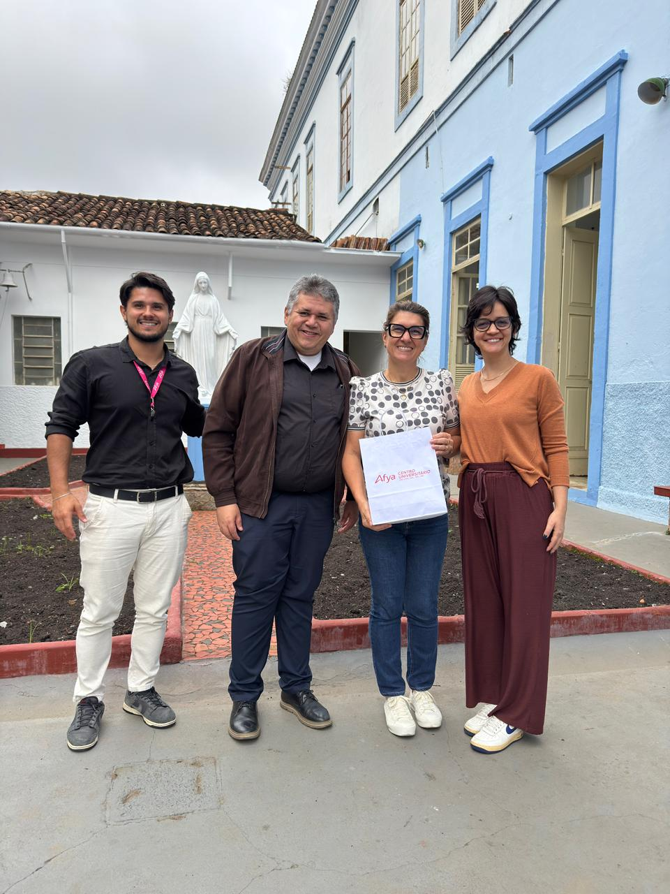

O NAPED participou de visita à **Escola Nossa Senhora das Dores** como parte do **Projeto MOVE**, iniciativa institucional da Afya que aproxima professores da educação básica do universo do ensino superior. Por meio de vivências práticas com metodologias ativas, ferramentas digitais e ambientes acadêmicos inovadores, o projeto abre um espaço genuíno de troca, formação e parceria entre os dois níveis de ensino. A visita teve como objetivo convidar a escola a integrar o projeto, fortalecendo os laços entre a Afya São João del Rei e a comunidade educacional local.

## Evidências

