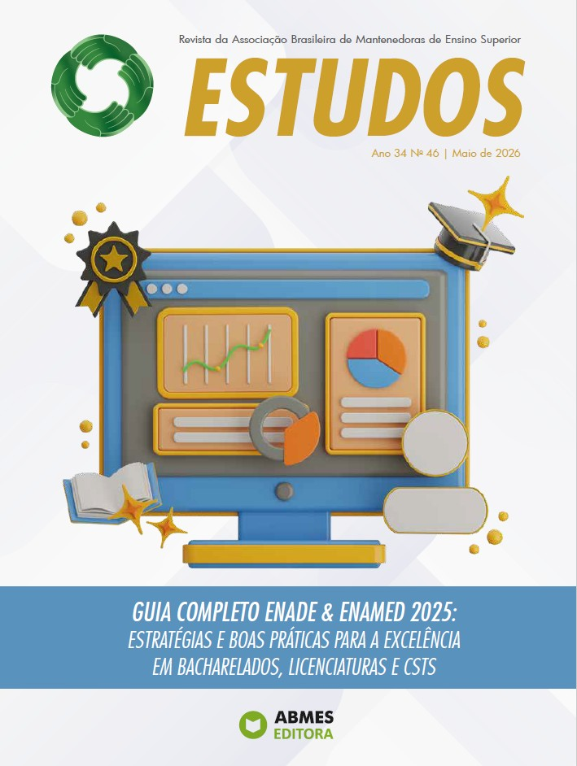

O Prof. Dr. Daniel Riani Gotardelo, docente da Afya São João del Rei, publicou artigo na **Revista Estudos** (Ano 34, Nº 46 — Maio de 2026), publicação da Associação Brasileira de Mantenedoras de Ensino Superior (ABMES). A edição, dedicada ao tema *"Guia Completo ENADE & ENAMED 2025: Estratégias e Boas Práticas para a Excelência em Bacharelados, Licenciaturas e CSTs"*, reúne contribuições de especialistas nacionais sobre avaliação da educação superior. A participação do docente evidencia o compromisso do NAPED com a produção de conhecimento e a qualificação dos processos avaliativos institucionais.

## Evidências

::: {layout-ncol=2}

:::
