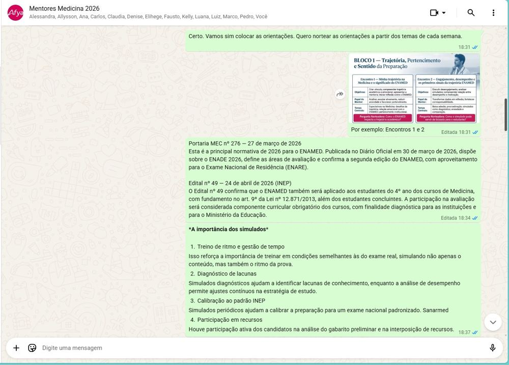
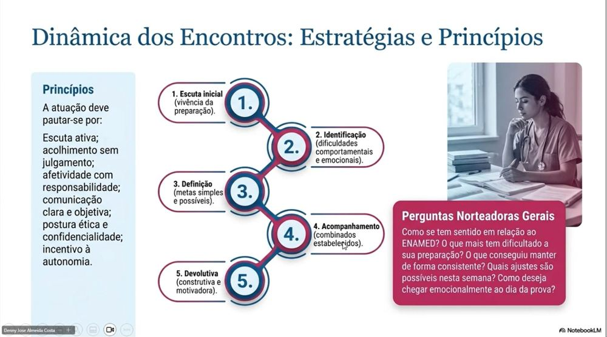
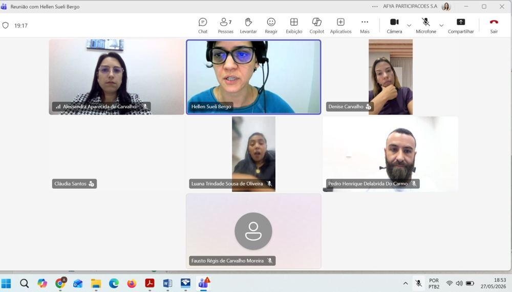
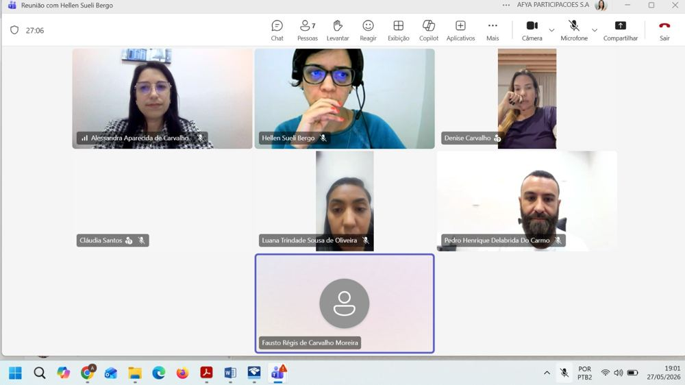
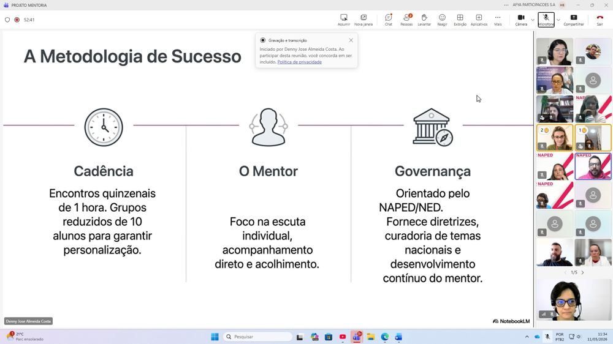
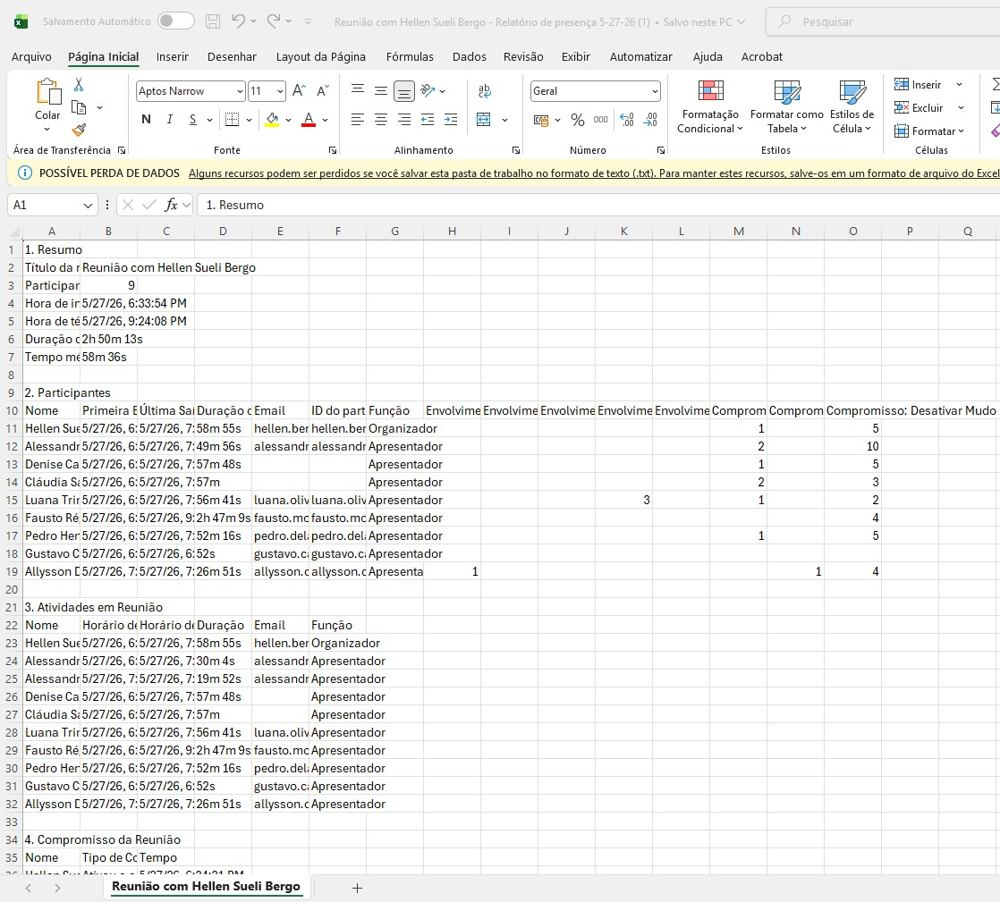
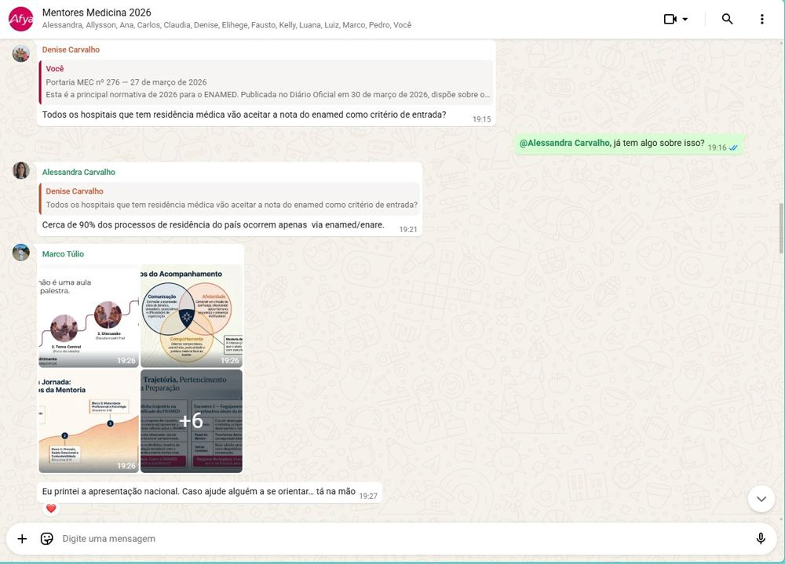
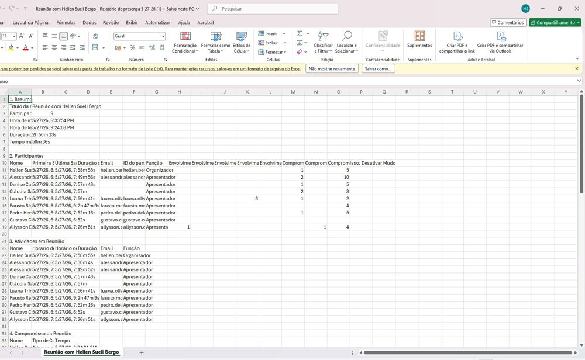
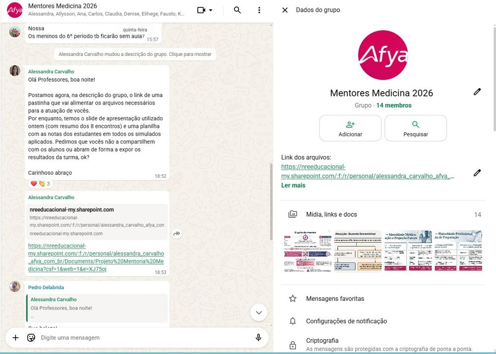

O Projeto Mentoria ENAMED estruturou um programa de acompanhamento individualizado dos estudantes de Medicina, com encontros quinzenais de uma hora em grupos reduzidos de até 10 alunos. A metodologia, orientada pelo NAPED/NED, foi apresentada por Denny Almeida e capacitou mentores docentes para atuar com escuta ativa, acolhimento e acompanhamento das trajetórias acadêmicas e emocionais dos estudantes em preparação para o ENAMED.

::: {.destaque}
Mentoria, ENAMED, grupos reduzidos, escuta ativa, acompanhamento docente, NAPED/NED.
:::

## Evidências

::: {layout-ncol=3}

:::
