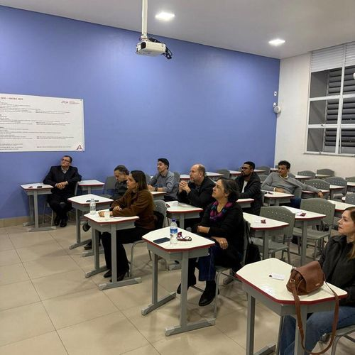
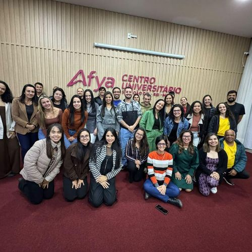
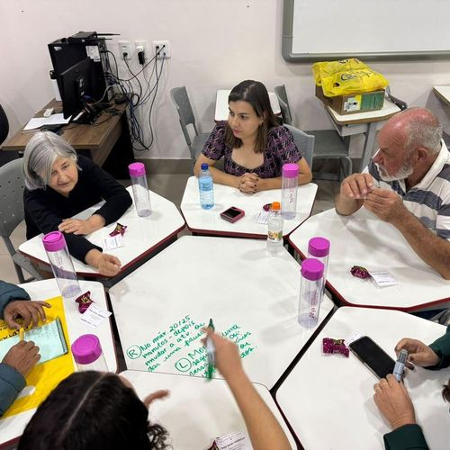

::: {layout-ncol=4 .mosaico}
{alt="SDD 2026 — plateia"}

{alt="SDD 2026 — palestra IA na docência"}

{alt="Projeto MOVE — encontro na Afya"}

{alt="Projeto MOVE — dinâmica em grupo"}
:::

::: {.numero-grid}

<b>81h</b>de formação docente

<b>113</b>docentes na SDD

<b>57</b>em capacitação contínua

<b>10</b>cursos alcançados

:::

Cada cartão abaixo é uma ação registrada. Use a busca ou os filtros ao lado
para encontrar por mês, por eixo de atuação ou por palavra do título.

::: {#vitrine}
:::

## Como este portfólio se mantém

Esta página não tem lista de ações escrita à mão. Ela varre a pasta
`acoes/` a cada publicação e monta os cartões sozinha. Para acrescentar
uma ação nova, cria-se **um único arquivo** — nenhum outro arquivo do
projeto precisa ser editado. O passo a passo está no
[COMO-ATUALIZAR.md](https://github.com/bergohellen-hub/portfolionaped2026/blob/main/COMO-ATUALIZAR.md).
