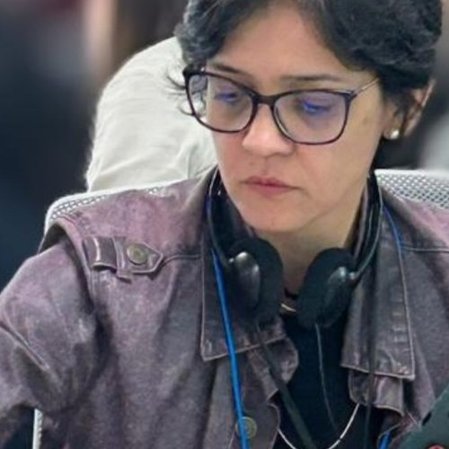
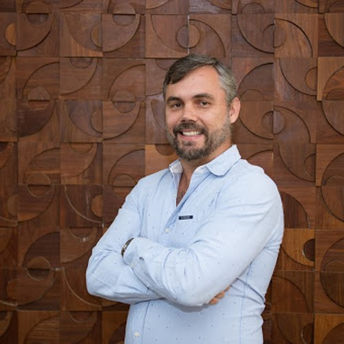
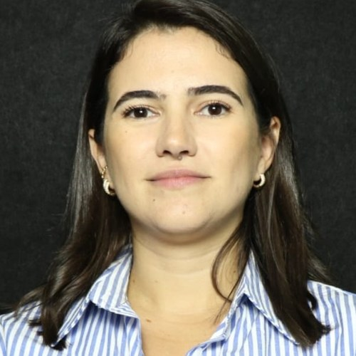
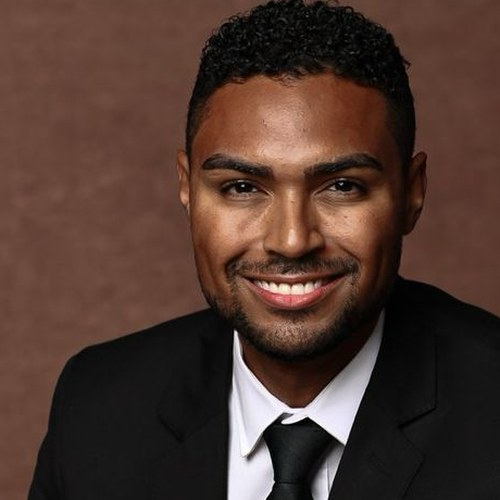

## A Equipe

O NAPED reúne a equipe responsável pelo apoio pedagógico e pela experiência docente
 do Centro Universitário Afya São João del-Rei, atuando junto às coordenações e aos
 professores dos cursos de Medicina e das áreas de Saúde, Humanas e Exatas (SHE).

::: {layout-ncol=3}

:::
