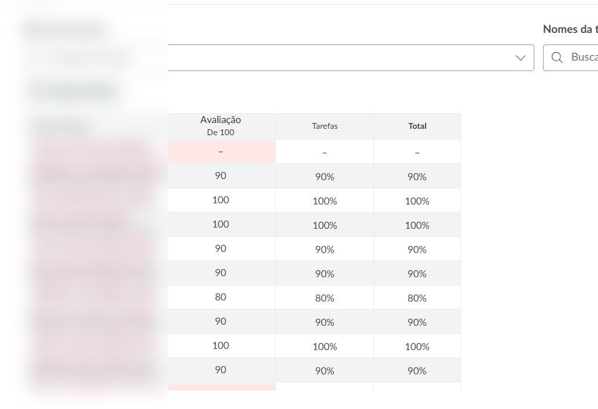
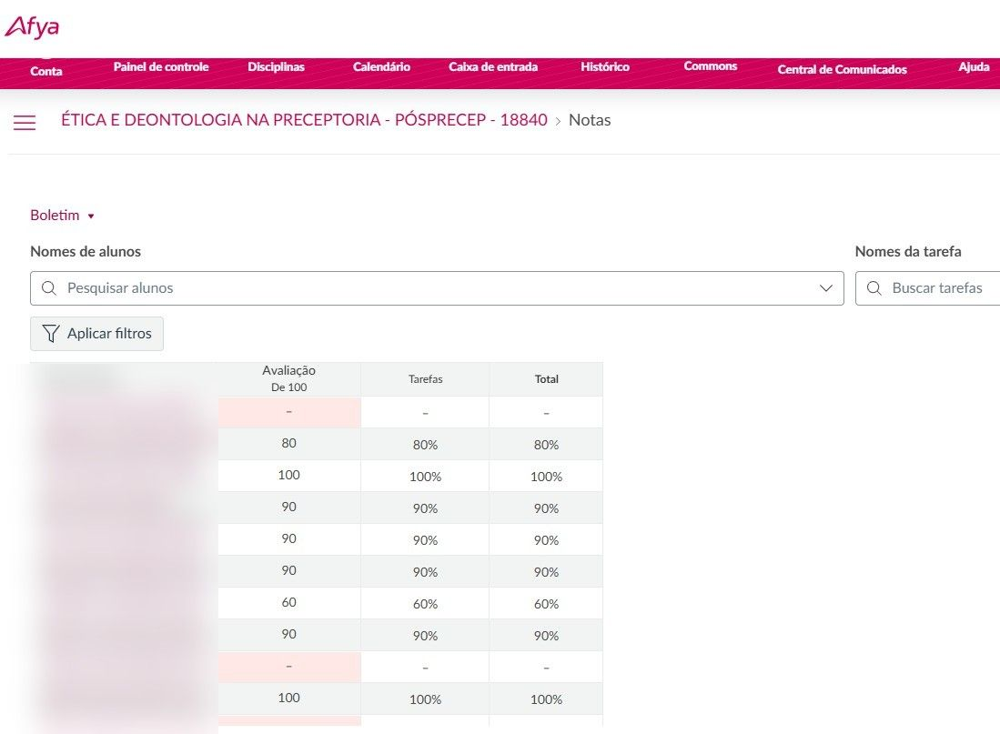
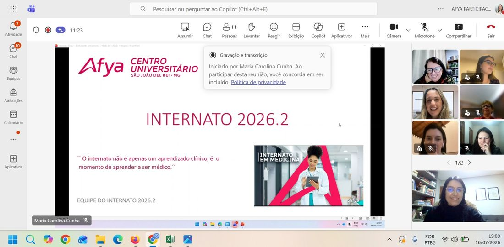
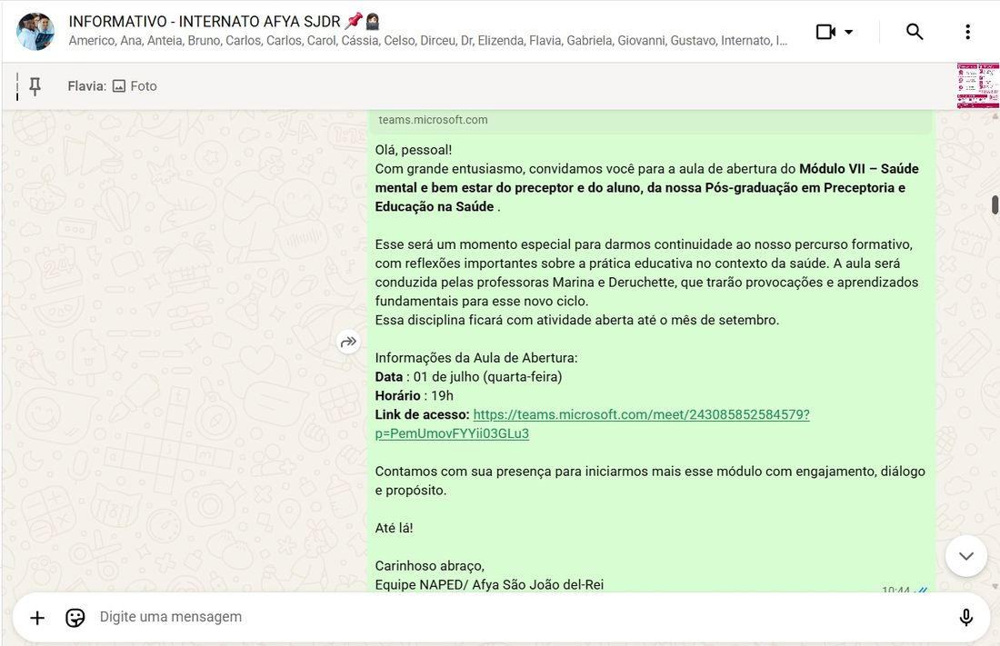

Programa de formação continuada voltado aos preceptores da Afya São João del-Rei, com módulos temáticos
 sobre supervisão, ética, saúde mental e bem-estar na prática da preceptoria. O NAPED acompanha o
 engajamento dos preceptores no Canvas e promove encontros periódicos de alinhamento e incentivo à
 participação.

::: {.numero-grid}

<b>63</b>preceptores participando da Pós-Graduação

<b>7+</b>módulos temáticos em andamento

<b>2026.2</b>semestre de referência do internato

:::

## Acompanhamento no Canvas

*Disciplinas da Pós-Graduação — engajamento e desempenho dos preceptores*

O NAPED acompanha de perto as disciplinas da Pós-Graduação em Preceptoria, monitorando avisos,
 prazos e o desempenho dos preceptores em cada módulo — como em "Habilidades de Supervisão" e
 "Ética e Deontologia na Preceptoria".

::: {layout-ncol=3}

:::

::: {.destaque}
Nomes individuais desfocados para preservar a privacidade dos preceptores avaliados.
:::

## Reunião com Preceptores

*16 de julho de 2026 · Alinhamento do Internato 2026.2*

Encontro on-line reunindo a equipe do NAPED, coordenação e preceptores para alinhar as diretrizes
 do Internato 2026.2 — reforçando que "o internato não é apenas um aprendizado clínico, é o momento
 de aprender a ser médico".

::: {layout-ncol=2}

:::

## Comunicação e Engajamento

*Grupo "Informativo — Internato Afya SJDR"*

Comunicados periódicos mantêm os preceptores informados sobre aulas de abertura de módulos, prazos
 de atividades avaliativas e prazos da Pós-Graduação, reforçando o engajamento contínuo com a formação.

::: {layout-ncol=2}

:::
